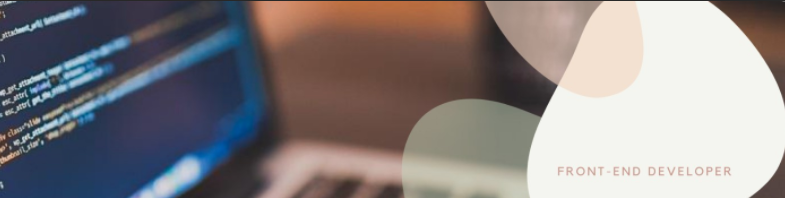

# Hi there, I'm Valeria,  
## but everyone knows me as Tai. 🌿

- 📚 Currently studying:  React.js , Material-UI.
- 💻  Working with: HTML5, CSS, JavaScript, Bootstrap4, Node.js, Firebase.
- 🛠  Other Tools: Git, GitHub, Figma, Trello, Miro.
- ☕  Open to talk.

## 💬 About Me

My name is Valeria Videla Mardones, Front-End Developer, Tech - Communication and Connectivity Lover. 
Compulsive writer, digital woman nomad from birth, passionate about arts.
 
🇨🇱 - Actually I'm student in Laboratoria/Bootcamp, from Chile.  
📷  - Also I'm Filmmaker and photographer :) so if you want you can see my other projects about this [HERE](https://www.valeriavidela.cl) 
 
I am constantly learning about programming so I that the most important thing here to me is the passion that I give to everything that I love, so I'm open to learning anything! 🌱

## 📫 Let's connect!

Visit my [LinkedIn](https://www.linkedin.com/in/valeriavidela/) to see more about me. :)
